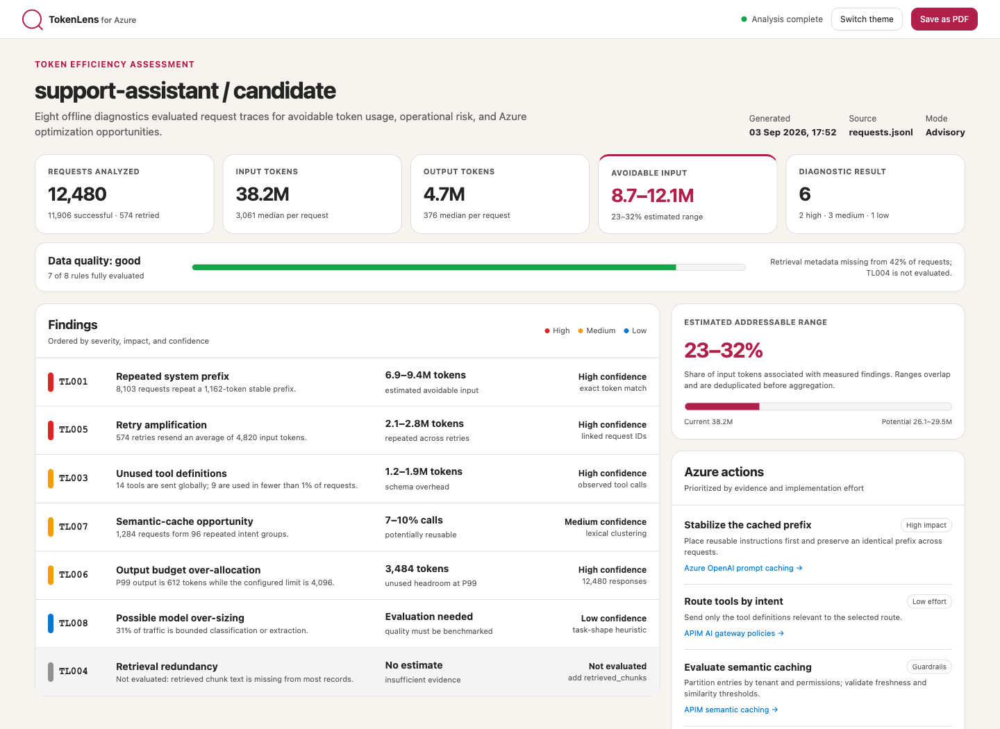
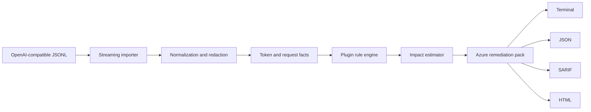

<div align="center">

# TokenLens for Azure

### Lint LLM traces for avoidable token usage

Analyze OpenAI-compatible JSONL locally, expose where tokens are being wasted, and map every finding to a practical Azure optimization.

[](#project-status)
[](#installation)
[](#private-by-design)
[](#azure-first-portable-core)

**No API key · No network calls · No prompts leaving your machine**

[Why TokenLens?](#why-tokenlens) · [Quick start](#quick-start) · [Diagnostics](#eight-diagnostics-one-consistent-contract) · [CI](#github-actions) · [Roadmap](#roadmap)

</div>

> [!IMPORTANT]
> TokenLens for Azure is currently a **pre-alpha design**. The commands and interfaces below define the intended v0.1 experience; the package has not yet been published.

## Why TokenLens?

LLM applications often spend more tokens than the task requires—not because of one dramatic mistake, but because small inefficiencies compound:

- a system prompt repeated thousands of times;
- chat history that grows without bounds;
- tool definitions sent even when they are never used;
- overlapping retrieval chunks;
- retries that resend the same context;
- output limits set far above actual responses;
- repeated questions that could be cached;
- expensive models handling routine work.

TokenLens turns those patterns into developer-friendly diagnostics with evidence, confidence, estimated impact, and a concrete remediation path.

## The report developers get

<a href="docs/tokenlens-report-demo.html">
  
</a>

<p align="center">
  <em>Sample data · Click the image to open the complete self-contained report mock-up.</em>
</p>

The report separates measured waste from heuristic opportunities, deduplicates overlapping estimates, exposes missing telemetry, and never presents an unevaluated rule as a pass.

```text
requests.jsonl
      │
      ▼
┌──────────────────┐    ┌───────────────────┐    ┌─────────────────────┐
│ Normalize traces │───▶│ Run 8 diagnostics │───▶│ Explain the impact  │
│ + redact evidence│    │ without an LLM     │    │ and confidence      │
└──────────────────┘    └───────────────────┘    └──────────┬──────────┘
                                                           │
                                                           ▼
                                                ┌─────────────────────┐
                                                │ Map findings to     │
                                                │ Azure optimizations │
                                                └─────────────────────┘
```

## Quick start

### Installation

```bash
pipx install git+https://github.com/zakarel/tokenlens-for-azure.git
```

Or run it in an isolated environment:

```bash
python -m pip install git+https://github.com/zakarel/tokenlens-for-azure.git
```

### Analyze a trace

```bash
tokenlens-azure analyze requests.jsonl
```

```text
TokenLens for Azure
────────────────────────────────────────────────────────────────────
Analyzed 12,480 requests · 38.2M input tokens · 4.7M output tokens

HIGH  TL001  Repeated system prefix
      9.4M repeated tokens across 8,103 requests
      Estimated avoidable input: 18–25% · Confidence: high
      Azure action: preserve a stable prefix to improve prompt-cache hits

MED   TL007  Semantic-cache opportunity
      1,284 requests form 96 repeated intent groups
      Estimated avoidable model calls: 7–10% · Confidence: medium
      Azure action: evaluate APIM semantic caching with tenant partitioning

LOW   TL008  Possible model over-sizing
      31% of traffic is short-form classification on a high-capability model
      Savings require quality evaluation · Confidence: low
      Azure action: benchmark Microsoft Foundry Model Router

8 rules processed · 6 findings · 1 not evaluated · advisory result
```

### Compare a change with a baseline

```bash
tokenlens-azure compare \
  baseline.jsonl \
  candidate.jsonl \
  --fail-on-regression 10%
```

TokenLens is **advisory by default**. It reports findings without breaking the build; teams explicitly opt into regression thresholds.

## Eight diagnostics, one consistent contract

| Rule | Detects | Method | Confidence |
|---|---|---|:---:|
| `TL001` | Repeated system prefixes and policy text | Stable leading-token comparison across requests | High |
| `TL002` | Unbounded conversation-history growth | History growth and current-turn contribution | High |
| `TL003` | Oversized or unused tool schemas | Schema-token cost compared with observed tool calls | High |
| `TL004` | Duplicate or overlapping retrieval context | Exact matching and lexical chunk similarity | Medium |
| `TL005` | Retry amplification | Retry IDs and normalized request fingerprints | High |
| `TL006` | Excessive output allocation | Configured limits compared with response distributions | High |
| `TL007` | Semantic-cache opportunities | Repeated-request clustering within workload boundaries | Medium |
| `TL008` | Possible model over-sizing | Bounded-task heuristics and workload repetition | Low–medium |

Every diagnostic returns the same explainable structure:

```json
{
  "rule_id": "TL001",
  "severity": "high",
  "title": "Repeated system prefix",
  "evidence": {
    "affected_requests": 8103,
    "repeated_tokens": 9400000
  },
  "estimated_savings": {
    "min_tokens": 6900000,
    "max_tokens": 9400000
  },
  "confidence": "high",
  "azure_recommendation": {
    "service": "Azure OpenAI",
    "capability": "Prompt caching"
  }
}
```

If the input lacks the data required by a rule, TokenLens returns **not evaluated**—never a silent pass and never an invented estimate.

## Azure-first, portable core

The analysis engine understands OpenAI-compatible traces rather than Azure-specific telemetry. Azure guidance is supplied by a separate remediation pack, keeping the core portable and future provider mappings possible.

| Finding | Default Azure remediation |
|---|---|
| Repeated stable prompt prefix | Azure OpenAI prompt caching |
| Repeated equivalent requests | Azure API Management semantic caching with Azure Managed Redis |
| Token spikes or uncontrolled consumers | APIM token rate limits and quotas |
| Likely model over-sizing | Microsoft Foundry Model Router evaluation |
| Noisy retrieval context | Azure AI Search chunking, hybrid retrieval and semantic reranking |
| Prompt/context compression opportunity | Custom compression workload hosted on Azure |
| Cross-workload visibility | Application Insights and Azure Monitor instrumentation |

> [!NOTE]
> “Equivalent” means an Azure capability addresses the same optimization problem; it does not imply feature-for-feature parity with an open-source project.

## Input format

TokenLens accepts one JSON object per line. Only `model`, `messages`, and `usage` are required.

```json
{
  "timestamp": "2026-09-03T12:00:00Z",
  "request_id": "req-123",
  "model": "gpt-5-mini",
  "messages": [
    {"role": "system", "content": "You are a support assistant."},
    {"role": "user", "content": "Where is my order?"}
  ],
  "tools": [],
  "max_output_tokens": 1000,
  "usage": {
    "input_tokens": 4200,
    "output_tokens": 380,
    "cached_tokens": 1800
  },
  "latency_ms": 1450,
  "status_code": 200,
  "retry_of": null,
  "retrieved_chunks": [],
  "metadata": {
    "workload": "support-assistant",
    "tenant": "hashed-value"
  }
}
```

Standard OpenAI and Azure OpenAI request/response envelopes will also be accepted by the importer, so developers do not need to redesign their logging schema.

## Reports

```bash
# Human-readable terminal output
tokenlens-azure analyze requests.jsonl

# Machine-readable diagnostics
tokenlens-azure analyze requests.jsonl --format json --output tokenlens.json

# GitHub code-scanning annotations
tokenlens-azure analyze requests.jsonl --format sarif --output tokenlens.sarif

# Shareable local report with methodology and evidence
tokenlens-azure analyze requests.jsonl --format html --output tokenlens-report.html
```

Reports exclude raw prompt content by default. Evidence uses counts, hashes, token ranges, and redacted excerpts unless a developer explicitly enables content output.

## GitHub Actions

```yaml
name: Token efficiency

on:
  pull_request:

jobs:
  tokenlens:
    runs-on: ubuntu-latest
    steps:
      - uses: actions/checkout@v4

      - uses: actions/setup-python@v5
        with:
          python-version: "3.12"

      - name: Analyze LLM traces
        run: |
          pip install tokenlens-azure
          tokenlens-azure compare \
            test-data/baseline.jsonl \
            test-data/requests.jsonl \
            --format sarif \
            --output tokenlens.sarif \
            --fail-on-regression 10%

      - name: Upload findings
        uses: github/codeql-action/upload-sarif@v3
        with:
          sarif_file: tokenlens.sarif
```

Existing inefficiencies stay in the baseline. Pull requests surface newly introduced waste rather than punishing teams for historical debt.

## Configuration

Create `.tokenlens.yml` in the repository root:

```yaml
version: 1

analysis:
  tokenizer: auto
  redact_content: true
  tenant_key: metadata.tenant
  workload_key: metadata.workload

rules:
  TL001:
    enabled: true
    minimum_repeated_tokens: 10000
  TL004:
    enabled: true
    similarity_threshold: 0.85
  TL008:
    enabled: true
    severity: info

ci:
  advisory: true
  fail_on_regression_percent: null
```

## Private by design

- Analysis runs entirely on the local machine or CI runner.
- Version 0.1 makes no network calls and requires no API key.
- No model is used to inspect, rewrite, or summarize prompts.
- Raw prompt content is omitted from reports by default.
- Tenant and workload boundaries are respected during cache analysis.
- Synthetic, privacy-safe traces are used in the public test suite.

TokenLens should be safe to bring to the data—not another service that asks developers to upload it.

## Design principles

1. **Evidence before advice** — every recommendation links to measurable trace behavior.
2. **Ranges before false precision** — estimates communicate uncertainty explicitly.
3. **Quality before savings** — model-routing findings call for evaluation, never blind downgrades.
4. **Advisory before enforcement** — build failures require deliberate configuration.
5. **Local before connected** — useful analysis must not depend on a cloud account.
6. **Portable detection, specific remediation** — generic rules with actionable Azure guidance.

## Proposed architecture



```text
src/tokenlens/
├── cli.py
├── config.py
├── ingest/
│   ├── jsonl.py
│   └── openai.py
├── models/
│   ├── trace.py
│   └── finding.py
├── rules/
│   ├── base.py
│   ├── tl001_prefix.py
│   ├── ...
│   └── tl008_model_sizing.py
├── estimation/
├── recommendations/
│   └── azure.yml
└── reports/
    ├── terminal.py
    ├── json.py
    ├── sarif.py
    └── html.py
```

## Roadmap

### v0.1 — Offline trace linter

- [ ] Streaming OpenAI-compatible JSONL importer
- [ ] Eight deterministic diagnostics
- [ ] Transparent savings ranges and confidence levels
- [ ] Terminal, JSON, SARIF, and HTML reports
- [ ] Advisory baseline comparison
- [ ] Azure remediation pack
- [ ] GitHub Action and Docker image

### Later

- [ ] APIM and Application Insights import adapters
- [ ] Pluggable provider recommendation packs
- [ ] Optional pricing catalogs supplied by the user
- [ ] Custom diagnostic plugins
- [ ] Trend reports across releases
- [ ] Optional Azure OpenAI-assisted analysis, disabled by default

## What TokenLens will not do in v0.1

- Rewrite prompts automatically
- Proxy production traffic
- Connect to Azure or any external service
- Guarantee financial savings
- Recommend a smaller model without calling for quality evaluation
- Treat missing telemetry as proof that a workload is efficient

## Contributing

The most valuable early contributions are:

- anonymized JSONL schema examples;
- synthetic traces that reproduce real token-efficiency problems;
- detector edge cases and false-positive reports;
- Azure remediation references;
- feedback on SARIF and pull-request workflows.

Contribution guidelines and a code of conduct will be added before the first public release.

## Project status

TokenLens for Azure is an early community project and is **not an official Microsoft product**. APIs, rule thresholds, and package names may change before v0.1.

---

<div align="center">

**Spend tokens on answers—not repetition.**

</div>
