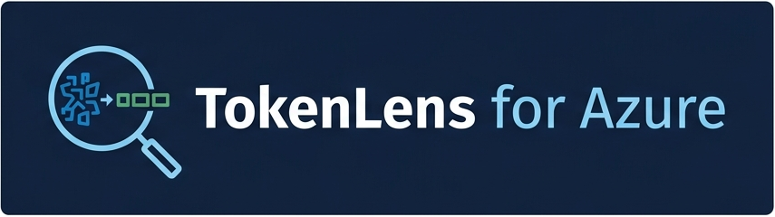
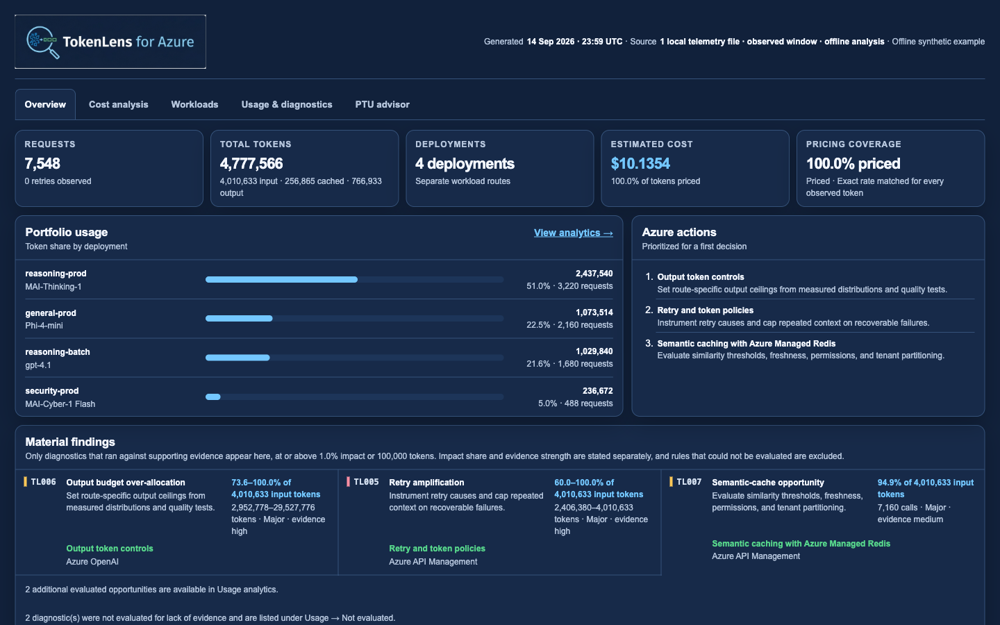
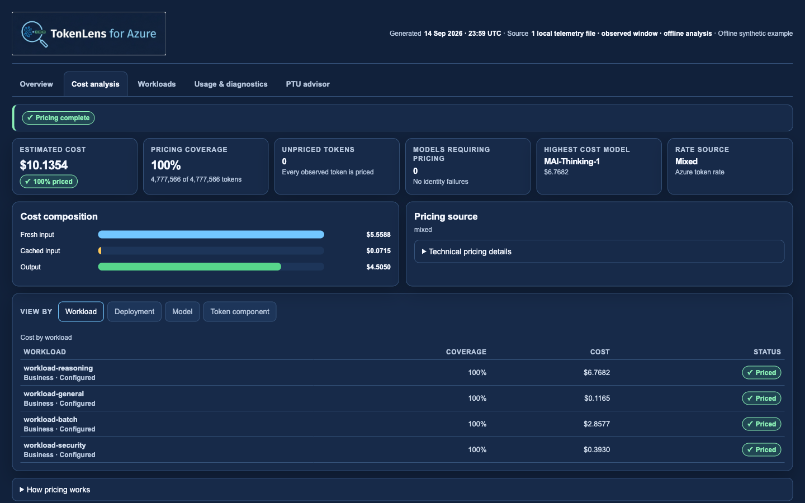
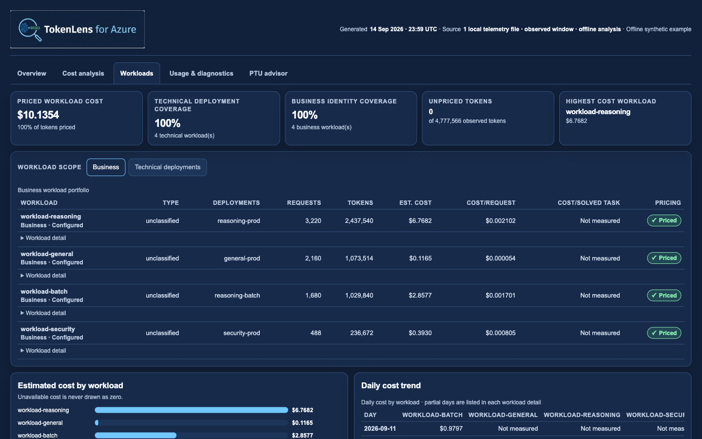
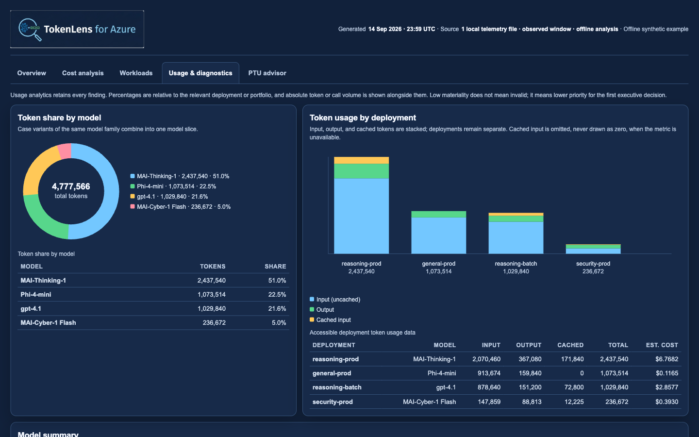
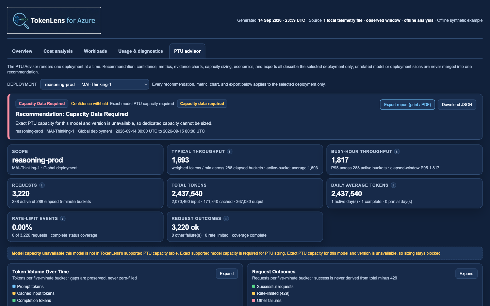

<div align="center">



# TokenLens for Azure

### Lint LLM traces for avoidable token usage

TokenLens is an offline Python CLI and GitHub Action that analyzes OpenAI-compatible JSONL traces, identifies token waste, and maps findings to practical Azure optimizations.

[](#what-is-tokenlens)
[](#prerequisites)
[](#privacy-and-security)
[](#azure-first-portable-core)

**No API key · No Azure account · No network calls · No prompts leaving your machine**

</div>

> [!IMPORTANT]
> TokenLens for Azure is currently **pre-alpha**. The project is usable as an MVP, but command interfaces, rule thresholds, and package names may change before v0.1.

## What is TokenLens?

TokenLens is a developer tool for understanding the hidden cost of LLM applications. It works like a linter for token usage: point it at representative request traces and it reports where context, retries, tools, outputs, caching, or model selection may be wasting tokens.

It is **Azure-first but provider-portable**. The detection engine understands OpenAI-compatible traces, while a separate recommendation layer maps findings to Azure OpenAI, Azure API Management, Microsoft Foundry, Azure AI Search, Azure Monitor, and Application Insights.

## What does it do?

TokenLens:

- analyzes JSONL locally without calling an LLM;
- evaluates eight token-efficiency diagnostics;
- reports evidence, estimated savings ranges, and impact percentages;
- distinguishes measured findings from heuristic opportunities;
- omits rules when the trace data cannot support a finding;
- recommends concrete Azure actions;
- estimates analyzed cost with exact model and deployment-mode pricing matches;
- evaluates PTU suitability, sizing, break-even, and hybrid spillover economics;
- groups cost by workload, not only by model or token, with an explicit Unassigned rollup;
- creates one deployment-backed technical workload automatically for every discovered deployment;
- emits terminal, JSON, SARIF, and self-contained HTML reports;
- compares a candidate trace set with a baseline;
- runs advisory by default, with opt-in CI regression thresholds.

The tool does not rewrite prompts, proxy production traffic, or claim guaranteed financial savings.

## How does it work?

```text
OpenAI-compatible JSONL
          │
          ▼
Normalize and redact
          │
          ▼
Run diagnostics, pricing, and PTU analysis
          │
          ▼
Estimate impact percentages
          │
          ▼
Map findings to Azure actions
          │
          ▼
Text · JSON · SARIF · HTML
```

Every finding follows the same explainable contract:

```json
{
  "rule_id": "TL001",
  "severity": "high",
  "title": "Repeated system prefix",
  "evidence": {
    "affected_requests": 8103,
    "repeated_tokens": 9400000
  },
  "estimated_savings": {
    "min_tokens": 6900000,
    "max_tokens": 9400000
  },
  "impact_min_percent": 18.1,
  "impact_max_percent": 24.7,
  "azure_recommendation": {
    "service": "Azure OpenAI",
    "capability": "Prompt caching"
  }
}
```

Optimisation scenarios are reported independently because caching, trajectory,
routing, reliability, and cleanup levers can overlap. TokenLens never adds
independent estimates into a misleading aggregate (for example, `100%–100%`).

## Example output

**Overview**

<a href="docs/assets/tokenlens-report-overview-20260917-v8.png">
  
</a>

**Cost analysis**

<a href="docs/assets/tokenlens-report-cost-analysis-20260917-v8.png">
  
</a>

**Workloads**

<a href="docs/assets/tokenlens-report-workloads-20260917-v8.png">
  
</a>

**Usage &amp; diagnostics**

<a href="docs/assets/tokenlens-report-usage-20260917-v8.png">
  
</a>

**PTU advisor**

<a href="docs/assets/tokenlens-report-ptu-advisor-20260917-v8.png">
  
</a>

<p align="center"><em>Deterministic synthetic data · Click any image to open the enlarged PNG.</em></p>

The report has five self-contained views:

- **Overview** combines consumption, estimated analyzed cost, pricing coverage, and priority actions.
- **Cost analysis** states one pricing decision state, four primary KPIs, cost composition, and a **View by** toggle across workload, deployment, model, and token component. Technical provenance is collapsed behind *Technical pricing details*.
- **Workloads** is the workload economics view: technical and business scopes, portfolio table, cost and daily trend charts, an explicit Unassigned rollup, an identity-versus-pricing readiness table, and task economics where task evidence exists.
- **Usage &amp; diagnostics** keeps the corrected multicolor model mix, visible model summary, deployment usage, and all findings.
- **PTU advisor** is a per-deployment decision dashboard: recommendation banner with evidence confidence, six At a Glance metrics, four evidence charts with synchronized zoom and expansion, capacity sizing, PAYG versus PTU + spillover economics, rationale, and a print/JSON export.

Charts are inline SVG with adjacent accessible tables, keyboard tabs, URL fragments,
mobile layout, and print styles. The checked-in demo is generated by
`scripts/generate-demo-report.py` from fictional task types and models.

The checked-in example is synthetic and contains exactly **7,548 requests** across four deployments using
`MAI-Thinking-1`, `Phi-4-mini`, `gpt-4.1`, and `MAI-Cyber-1 Flash`.
Overview materiality uses both percentage and absolute token impact; Usage &
diagnostics retains lower-impact findings rather than deleting them.

## Prerequisites

Before installing TokenLens, make sure you have:

- **Python 3.11 or newer**;
- **pip** or **pipx**;
- an OpenAI-compatible JSONL trace file;
- representative request data with `model`, `messages`, and `usage`.

You do **not** need:

- an Azure subscription;
- an Azure OpenAI or OpenAI API key;
- network access at analysis time;
- a database or hosted service.

## Installation

### Install from GitHub with pipx

```bash
pipx install git+https://github.com/zakarel/tokenlens-for-azure.git
```

### Install from GitHub with pip

```bash
python -m pip install git+https://github.com/zakarel/tokenlens-for-azure.git
```

### Install for local development

```bash
git clone https://github.com/zakarel/tokenlens-for-azure.git
cd tokenlens-for-azure
python3 -m venv .venv
.venv/bin/python -m pip install -e ".[dev]"
.venv/bin/tokenlens-azure --help
```

No shell activation is required. On Windows PowerShell, use:

```powershell
py -m venv .venv
.\.venv\Scripts\python.exe -m pip install -e ".[dev]"
.\.venv\Scripts\tokenlens-azure.exe --help
```

For the complete Foundry smoke-test and Azure Monitor collection workflow,
install all provider and collector extras before running `doctor`:

```bash
.venv/bin/python -m pip install -e ".[foundry,foundry-claude,foundry-monitor]"
.venv/bin/tokenlens-azure doctor
```

`doctor` should report the Azure OpenAI, Claude, and Foundry Monitor capabilities
as ready. A `collector-extras=missing` message means collection is not ready;
run the installation command above inside the same virtual environment.
Activating with
`. .venv/bin/activate` (POSIX) or `.venv\Scripts\Activate.ps1` (PowerShell) is
an optional convenience only.

The package will be published to PyPI after the v0.1 interface stabilizes.

## How to use it

### Analyze a trace file

```bash
.venv/bin/tokenlens-azure analyze requests.jsonl
```

The command is advisory and exits successfully while reporting findings.
Pass multiple JSONL files, a directory, or a glob to analyze every observed
deployment: `.venv/bin/tokenlens-azure analyze "traces/*.jsonl"`.

### Generate a JSON report

```bash
.venv/bin/tokenlens-azure analyze requests.jsonl \
  --format json \
  --output tokenlens.json
```

### Generate a GitHub SARIF report

```bash
tokenlens-azure analyze requests.jsonl \
  --format sarif \
  --output tokenlens.sarif
```

### Generate a shareable HTML report

```bash
tokenlens-azure analyze requests.jsonl \
  --format html \
  --output-dir reports \
  --open
```

When `--output` is omitted, HTML, JSON, and SARIF reports use a UTC filename
such as `tokenlens-report-20260914-082311Z.html`; collisions receive `-2`,
`-3`, and so on. Text remains on stdout. Use `--output` when a script needs a
stable path.

### One command: `tokenlens-azure foundry`

The guided workflow replaces the manual sequence below. It discovers your Azure
resources, collects the right telemetry, reports pricing readiness, generates
the report, and opens it.

```bash
az login
.venv/bin/python -m pip install -e ".[foundry,foundry-claude,foundry-monitor]"
.venv/bin/tokenlens-azure foundry
```

The normal path asks four questions:

1. Azure subscription
2. Foundry account
3. Deployments (multi-select)
4. Analysis window

```text
TokenLens Foundry setup

Step 1/4 · Azure subscription
  1. Production Subscription · 1234abcd…9012 (Azure CLI active)
  2. Sandbox Subscription · 5678efgh…3456

Step 3/4 · Deployments
  1. ◉ reasoning-prod   gpt-4.1 v2026-04-14   Global Standard   ✓ Exact public rate
  2. ◉ coding-prod      claude-opus-5 v2      Global Standard   ⚠ Model identified, rate unavailable
  3. ○ compact-prod     ministral-3b v1       Regional Standard ⚠ Model identified, rate unavailable

Technical workloads created automatically
✓ reasoning-prod — deployment-backed workload · Needs configuration
✓ coding-prod — deployment-backed workload · Needs configuration

Collection complete
2 / 2 deployments succeeded
14-day window
model-identity-coverage=100%
token-pricing-coverage=52%
report=reports/tokenlens-report-20260915-081200Z.html
```

Deployment mode, provider family, inference API, account endpoints, and the
regional Azure Monitor endpoint are detected from exact Azure metadata. Nothing
is inferred from a name, and an unknown mode stays `unknown` rather than
defaulting to Global. The workflow never makes an inference call; smoke testing
remains a separate, explicitly billable command.

#### Repeat and change setup

```bash
.venv/bin/tokenlens-azure foundry refresh       # same settings, idempotent re-collection
.venv/bin/tokenlens-azure foundry configure     # change subscription/account/deployments/window
.venv/bin/tokenlens-azure foundry status        # configuration, coverage, and last run
.venv/bin/tokenlens-azure foundry pricing       # exact pricing state per deployment
```

#### Noninteractive automation

```bash
.venv/bin/tokenlens-azure foundry collect \
  --subscription SUBSCRIPTION_ID \
  --resource-group RESOURCE_GROUP \
  --account ACCOUNT \
  --deployment DEPLOYMENT_A \
  --deployment DEPLOYMENT_B \
  --days 14 \
  --format html \
  --output-dir reports
```

Noninteractive runs never prompt and never fall back to an ambiguous ambient
Azure CLI context. Exit codes are stable:

| Code | Meaning |
|---|---|
| `0` | Every selected deployment collected |
| `3` | Partial success — some deployments collected, some failed |
| `1` | No deployment succeeded, or a required value was missing |
| `2` | The requested operation is deliberately deferred (`pricing sync`) |

A non-TTY environment prints help instead of waiting for an answer.

#### What the workflow stores

`.tokenlens.yml` gains a versioned, credential-free block. Existing keys are
preserved, and a version 1 configuration migrates automatically on first write:

```yaml
version: 2
foundry:
  subscription_id_env: AZURE_SUBSCRIPTION_ID   # the ID itself is stored user-locally
  resource_group: "..."
  account: "..."
  region: eastus2
  deployments:
    - name: reasoning-prod
      model: gpt-4.1
      model_version: "2026-04-14"
      sku: GlobalStandard
      deployment_mode: global
      provider_family: azure_openai
      inference_api: openai
collection:
  lookback_days: 14
  granularity_minutes: 5
  output_dir: local-traces/foundry-metrics
  task_events_dir: null
report:
  format: html
  output_dir: reports
  open: true
workloads:
  defaults:
    create_for_each_deployment: true
    scope: technical
    type: ai_deployment
  mappings: []
```

No key, token, connection string, endpoint, or subscription ID is written into
`.tokenlens.yml`. The remembered subscription, the customer pricing catalog, and
run state (last collection, coverage, and the relative report path) are kept
outside the repository in the platform application-data directory — or in
`TOKENLENS_CONFIG_DIR` when set — with user-only permissions. `.tokenlens.yml`
still names your Azure resource group, account, and deployments, so do not stage
it.

### Advanced: individual collection commands

The commands below remain available for automation and for the paths the guided
workflow does not cover. TokenLens analysis is offline. Collection is an explicit, separate step using
the Entra ID credential chain—no API key is required.

#### Which collection path do I need?

| Goal | Recommended path |
|---|---|
| Verify one deployment works | `tokenlens-azure smoke-test-foundry` |
| Analyze prompt/token efficiency | SDK wrapper (`tokenlens.integrations`) or OpenTelemetry |
| Decide whether PTU is worthwhile | `tokenlens-azure collect-foundry-metrics` |
| Analyze OpenTelemetry telemetry you already have | `tokenlens-azure import-otel` |
| Analyze an Application Insights/Log Analytics export you already have | `tokenlens-azure import-app-insights` |
| Query Application Insights directly for GenAI traces | `tokenlens-azure collect-app-insights` |
| Analyze existing logs in another JSON shape | `tokenlens-azure import --mapping` |
| Centralize usage metadata at the gateway instead of the client | APIM AI Gateway policy (see below) |

You never run a TokenLens command per prompt. Instrument the client once, or
collect Azure Monitor aggregates once per window.

#### 1. Smoke test one deployment

Pass the endpoint directly so switching providers does not depend on stale shell
environment variables.

**Azure OpenAI / Microsoft models:**

```bash
az login
.venv/bin/tokenlens-azure doctor
.venv/bin/tokenlens-azure smoke-test-foundry \
  --deployment YOUR_DEPLOYMENT \
  --api openai \
  --endpoint "https://YOUR-RESOURCE.openai.azure.com/"
```

This makes **exactly one billable request** and says so before running. It
proves connectivity and normalization. It cannot support PTU analysis: one call
per deployment is not a representative workload. Claude deployments use
`--api anthropic` and the Messages API; they are never routed through OpenAI
chat completions.

**Claude on Foundry:**

```bash
.venv/bin/tokenlens-azure smoke-test-foundry \
  --deployment YOUR_CLAUDE_DEPLOYMENT \
  --api anthropic \
  --endpoint "https://YOUR-RESOURCE.services.ai.azure.com"
```

The Claude smoke-test path requests an Entra token for
`https://ai.azure.com/.default`; no Anthropic API key is required. TokenLens
accepts either the resource base URL above or the full URL ending in
`/anthropic` and normalizes it automatically.

The OpenAI smoke test uses `max_completion_tokens`, which is required by modern
models such as GPT-5.6 Luna. The Claude path uses the native `max_tokens`
Messages API field.

#### 2. Collect application request telemetry

Instrument the model client once at application startup:

```python
from tokenlens.integrations.openai import instrument_openai

client = instrument_openai(
    existing_client,
    deployment_mode="global",        # Global or Regional; never inferred
    workload="support-assistant",
)

response = client.chat.completions.create(model="support-prod", messages=messages)
```

```python
from tokenlens.integrations.anthropic_foundry import instrument_anthropic_foundry

client = instrument_anthropic_foundry(existing_client, deployment_mode="global", workload="coding-agent")
```

The wrapper adds no extra inference request, returns the SDK's own response
object, supports streaming, and writes contentless records to
`./tokenlens-traces/tokenlens-YYYY-MM-DD.jsonl`. See
`examples/instrument_azure_openai.py` and `examples/instrument_claude_foundry.py`.

Already emitting OpenTelemetry GenAI spans? Mirror them instead:

```python
provider.add_span_processor(TokenLensSpanProcessor(output_dir="tokenlens-traces"))
```

or import an export offline:

```bash
.venv/bin/tokenlens-azure import-otel spans.json --output-dir tokenlens-traces
```

Already have telemetry somewhere else? Three more offline-safe paths cover
existing data without a new SDK integration:

**Application Insights / Log Analytics.** If GenAI OpenTelemetry attributes
already reached Application Insights (for example via an OpenTelemetry
exporter), import an export you already have — either the
`{"tables": [...]}` shape from `az monitor app-insights query`/the Logs REST
API, or a flat continuous-export JSON/JSONL file:

```bash
.venv/bin/tokenlens-azure import-app-insights app-insights-export.json --output-dir tokenlens-traces
```

This reuses the OpenTelemetry importer's attribute allow list and content
rejection directly, so the two commands behave identically for equivalent
data. To query Application Insights directly instead of exporting first, use
the explicit collection command (install `tokenlens-azure[foundry-monitor]`
for `azure-monitor-query`):

```bash
az login
.venv/bin/tokenlens-azure collect-app-insights --workspace-id LOG_ANALYTICS_WORKSPACE_ID --days 14
```

`collect-app-insights` is the only Application Insights path that contacts
Azure, and it says so before running. It sends one fixed, reviewable KQL
query that selects GenAI usage dimensions (`customDimensions`, duration,
success, result code) — never a request/response body column — and maps the
result the same way `import-app-insights` does.

**Existing logs in another JSON shape.** If your logs already carry
usage/latency data but not in TokenLens's or OpenTelemetry's shape, describe
the mapping declaratively instead of writing a converter:

```bash
.venv/bin/tokenlens-azure import app-logs.jsonl --mapping tokenlens-mapping.yml
```

See `examples/generic-log-mapping-example.yml` for a documented template. The
mapping file is parsed with `yaml.safe_load` only — it can never execute code
— and it may only target TokenLens's contentless schema fields, so it has no
destination for prompt, response, tool, or credential content even if a
source path pointed at one. A source path whose final segment looks like
content or a credential is rejected before any row is read.

**API Management AI Gateway.** If you front Azure OpenAI/Foundry deployments
with APIM, you can centralize usage metadata at the gateway instead of (or in
addition to) instrumenting every client. `examples/apim-ai-gateway-policy.xml`
is a documented, metadata-only policy example: it emits deployment/model,
token usage, latency, and HTTP status via APIM's built-in
`azure-openai-emit-token-metric`/`emit-metric` policies, and it never reads a
request/response body or logs a header value. TokenLens does not apply this
policy for you — copy the fragment you need into your own API/operation
policy and adjust the metric destination. **APIM's AI Gateway policy support
differs by model API and APIM SKU/version**; verify current policy names and
availability in the Azure API Management documentation before relying on it,
and use the file's generic `emit-metric` fallback for backends (for example
Claude on Foundry) that have no dedicated token-metric policy.

#### 3. Collect Azure Monitor metrics for PTU

```bash
az login
.venv/bin/python -m pip install -e ".[foundry-monitor]"
.venv/bin/tokenlens-azure connect-foundry
.venv/bin/tokenlens-azure doctor
.venv/bin/tokenlens-azure collect-foundry-metrics \
  --resource-group RESOURCE_GROUP \
  --account ACCOUNT \
  --days 14 \
  --deployment YOUR_DEPLOYMENT \
  --deployment-mode global
.venv/bin/tokenlens-azure analyze local-traces/foundry-metrics --format html --open
```

When `--subscription` and `AZURE_SUBSCRIPTION_ID` are absent, TokenLens uses the
active Azure CLI subscription and prints
`subscription-source=azure-cli-active` before contacting Azure. Azure CLI can
choose a default automatically after login, so verify it and select the intended
subscription before collection:

```bash
az account show --query "{name:name,id:id}" -o table
az account set --subscription "SUBSCRIPTION NAME OR ID"
```

You may still pass `--subscription` or set `AZURE_SUBSCRIPTION_ID` for
noninteractive automation. TokenLens never scans every accessible subscription.

The collector reads the Foundry account location and automatically selects the
matching regional Azure Monitor endpoint, such as
`https://eastus2.metrics.monitor.azure.com`. Set
`TOKENLENS_METRICS_ENDPOINT` only as an advanced override for sovereign clouds
or an unusual endpoint.

`collect-foundry-metrics` contacts Azure Monitor and collects five-minute
aggregate counters only: token volume, request counts, HTTP 429 counts, and
average latency. It never collects request bodies, prompts, responses, user
IDs, IP addresses, or headers, and it never writes a subscription, tenant, or
resource identifier into telemetry. Re-running the same window is idempotent:
bucket identifiers are deterministic and are checked against the records already
in the output directory, so an overlapping re-collection appends only new
buckets. `--deployment-mode` applies to every collected deployment, including an
unrestricted collection where deployment names are discovered from the returned
metric dimensions. Metrics the resource does not expose are reported as missing,
never substituted with zero.

Discovery is scoped to the explicitly passed, configured, or Azure CLI-selected
subscription.

`connect-foundry` asks at most four questions, writes a credential-free
`.tokenlens.yml`, and creates private output directories. `doctor` reports
offline-analyzer readiness, each optional extra, credential availability,
configuration validity, and output-directory permissions without ever making an
inference call.

#### First-run error guide

| Message | Meaning and fix |
|---|---|
| `collector-extras=missing` | Install `.[foundry-monitor]` in the same virtual environment, then rerun `doctor`. |
| `Missing credentials` from Claude | Run `az login`; use `--api anthropic`. TokenLens passes the Entra token provider automatically. |
| Claude `404 Resource not found` | Use the Foundry services endpoint with `--endpoint https://RESOURCE.services.ai.azure.com`; do not use the OpenAI endpoint. |
| Claude endpoint must end in `/anthropic` | Current versions append `/anthropic` automatically when the services base URL is supplied. |
| `max_tokens is not supported` | Update TokenLens; the OpenAI smoke path now uses `max_completion_tokens`. |
| `No subscription selected` | Run `az account set --subscription ...`, pass `--subscription`, or set `AZURE_SUBSCRIPTION_ID`. |
| `missing ... credential` from QueryMetrics | Update TokenLens; the collector now constructs the regional client with `DefaultAzureCredential`. |
| Azure Monitor `status 400` | Update TokenLens; metrics are queried separately so incompatible dimension combinations do not abort collection. |
| `metric-rejected=NAME reason=...` | Azure refused that metric/dimension combination. Collection continues; the canonical field is reported as missing rather than zero. |
| `excluded_metrics={'SuccessfulCalls': ...}` | The metric's own definition does not support a `ModelDeploymentName` filter, so it was never queried. Request outcomes come from `ModelRequests` status-code series instead. |
| `metric series without a ModelDeploymentName dimension` | Collect one deployment at a time with `--deployment`, so usage is never attributed to the wrong route. |
| `identity-conflict=...` | The deployment inventory and the metric dimensions disagree on model or version. The metric dimension is kept and the conflict is reported; confirm the deployment in the portal. |
| `deployment-inventory=unavailable` | The signed-in principal can read metrics but not deployments. Collection continues; exact model identity then depends on the metric dimensions alone. |
| Report says `Collection identity error` | The collected buckets carry no model identity. Re-collect with `--deployment`, or grant read access to the account's deployments. |
| `This input mixes request-level telemetry with aggregate Azure Monitor buckets` | Analyze each source separately. Pass `--allow-mixed-sources` only when you have proven the two do not describe the same traffic. |
| Report says `Requests: Unavailable` | The resource exposed no request metric for the window. TokenLens never substitutes the bucket count for a request count. |
| Report says `Insufficient evidence` with few active buckets | Only buckets with nonzero tokens or requests count as evidence. Collect a representative window before sizing PTU. |

#### Aggregate telemetry semantics

Azure Monitor returns time buckets, not requests. TokenLens keeps four counts
separate and never interchanges them:

| Count | Meaning |
|---|---|
| Elapsed buckets | Intervals the collection window covers (14 days at five minutes = 4,032). |
| Observed buckets | Intervals for which Azure returned a data point. |
| Active buckets | Observed intervals with nonzero token or request volume. |
| Requests | The sum of the request metric — never a bucket count. |

Request outcomes are derived from `ModelRequests` split by `StatusCode`, so a
zero HTTP 429 count is reported as a genuine zero only when status coverage is
complete; otherwise it stays unavailable. Request-level diagnostics (prompt
repetition, retries, caching, model sizing) are **not evaluated** against
aggregate telemetry: they are listed as coverage gaps and never counted as
findings.

#### Report privacy

The HTML and JSON reports summarize the input as a file count and window
(`15 local metric files · 14-day window · offline analysis`) instead of
rendering local paths. Pass `--include-source-paths` to opt in when you need
paths for local debugging. Reports are labelled `Local offline analysis`;
only the bundled demo generator may label a report as synthetic.

#### Privacy model

Default telemetry **never** contains prompts, responses, system messages, tool
arguments, retrieved text, headers, API keys, bearer tokens, connection
strings, endpoints, or tenant/subscription/request identifiers. There is no
content-capture mode in this release; `telemetry.content_capture: true` is
rejected.

Repeated-prefix diagnostics use keyed HMAC-SHA256 fingerprints of the system
prompt and tool schema, never the text itself:

```bash
export TOKENLENS_FINGERPRINT_KEY="$(python -c 'import secrets;print(secrets.token_hex(32))')"
```

If no key is configured, fingerprints are omitted rather than downgraded to an
unsalted hash. The key lives in your environment and is never written into
telemetry.

#### Rotation, retention, and backpressure

| Setting | Environment variable | Default |
|---|---|---|
| Output directory | `TOKENLENS_TELEMETRY_DIR` | `tokenlens-traces` |
| Size rotation | `TOKENLENS_TELEMETRY_MAX_MB` | `50` |
| Retention | `TOKENLENS_TELEMETRY_RETENTION_DAYS` | `30` |
| Sampling | `TOKENLENS_TELEMETRY_SAMPLE_RATE` | `1.0` |
| Strict mode | `TOKENLENS_TELEMETRY_STRICT` | `false` |

Files rotate daily and by size, are created with owner-only permissions, and
retention only ever deletes TokenLens's own dated files inside the configured
directory. Retention is measured by **local file age**, not by the timestamps
inside a file, so a backfilled window — an imported OpenTelemetry export or a
14-day Azure Monitor collection — is never deleted by the same run that wrote
it. Telemetry failures never fail a model call unless `strict` is enabled, but
they are never silent either: an error callback fires, warnings are
rate-limited, and `writer.dropped_events` exposes the count. PTU aggregate
metrics are never sampled.

Collection and import are **idempotent**. Canonical records carry a
deterministic `event_id`, so re-running `import-otel`, `import-app-insights`,
`import` (generic mapping), `collect-app-insights`, or
`collect-foundry-metrics` over an overlapping window appends only what is new
and reports `records-already-present`. Analysis deduplicates on the same
identifier, so a rotated file copied beside its original is not counted twice.
Legacy schema v1/v2 traces have no canonical identifier and are never
deduplicated.

#### Legacy capture example

The earlier `examples/capture_foundry.py --prompt ...` workflow still exists as
a manual smoke test and is superseded by `smoke-test-foundry`. `init-foundry`
creates a private `foundry-traces/` directory and a copy of that example.

### Compare a candidate with a baseline

```bash
tokenlens-azure compare \
  baseline.jsonl \
  candidate.jsonl \
  --fail-on-regression 10
```

`--fail-on-regression` is optional. It enables an explicit CI gate when the candidate’s addressable-waste percentage increases beyond the supplied number of percentage points.

### Audit pricing coverage without generating a report

```bash
tokenlens-azure pricing-audit requests.jsonl
```

`pricing-audit` never makes a network call. For each unique returned model
ID it prints the deployment mode, service tier, request/token coverage, the
selected catalog and billing basis, the unresolved reason when a model does
not price, and a suggested local override key — without ever printing
endpoints, resource IDs, tenant values, request IDs, or prompt/response
content. Use it to find exactly which models need a customer catalog entry
before generating a full report.

### Read from standard input

```bash
cat requests.jsonl | tokenlens-azure analyze -
```

## Input format

TokenLens accepts one JSON object per line. `model`, `messages`, and `usage` are
the minimum request-analysis fields. Accurate pricing additionally needs the
underlying `model_name` and `deployment_mode`; PTU analysis needs valid
timestamps and benefits from latency and status-code evidence.

```json
{
  "timestamp": "2026-09-03T12:00:00Z",
  "request_id": "req-123",
  "model": "support-prod",
  "deployment_name": "support-prod",
  "model_name": "MAI-Thinking-1",
  "provider": "azure_foundry",
  "deployment_mode": "global",
  "messages": [
    {"role": "system", "content": "You are a support assistant."},
    {"role": "user", "content": "Where is my order?"}
  ],
  "tools": [],
  "max_output_tokens": 1000,
  "usage": {
    "input_tokens": 4200,
    "output_tokens": 380,
    "cached_tokens": 1800
  },
  "latency_ms": 1450,
  "status_code": 200,
  "retry_of": null,
  "retrieved_chunks": [],
  "metadata": {
    "workload": "support-assistant",
    "tenant": "hashed-value"
  }
}
```

Standard OpenAI and Azure OpenAI request/response envelopes are normalized by the importer, so applications do not need to redesign their logging schema.

## Account cost and PTU advisor

The packaged reference catalog is a dated offline snapshot of
[Microsoft Foundry model pricing](https://azure.microsoft.com/en-us/pricing/details/ai-foundry-models/microsoft/).
TokenLens matches provider, canonical model, service tier, deployment mode, and
explicit aliases. Dated model-version suffixes are preserved, and missing
deployment modes remain unresolved rather than defaulting to Global. The
analysis-date snapshot is applied as a current estimate even when traces are
older; it is not presented as historical billing data. TokenLens never
substitutes the nearest model: unmatched traffic stays visible as
`Pricing unavailable` and is excluded from monetary totals. A report uses one
currency and performs no implicit conversion, so prices in other currencies
remain unresolved. Reference prices are estimates, not invoices; negotiated
agreements, offers, regions, currencies, and later price changes may differ.

The PTU view adapts the workload dimensions, model-capacity data, sizing,
break-even, and hybrid spillover formulas from Microsoft's MIT-licensed
[PTU Advisor](https://github.com/msftse-org/ptu-advisor), revision
`eb0558cd4c6d3794be76d9caa2e87129d1f8221c`. It aggregates request traces into
five-minute buckets and evaluates each deployment independently. Unknown models
never fall back to GPT-4o capacity. If exact PAYG pricing or supported capacity
is unavailable, TokenLens shows the workload evidence without inventing a
monetary comparison. Hybrid economics sweep valid PTU increments and select the
lowest-cost reserved baseline plus PAYG spillover rather than assuming a
peak-sized commitment. See [Third-Party Notices](THIRD_PARTY_NOTICES.md).

### Coverage-aware, multi-source pricing

Each price entry carries a `billing_basis` alongside its rate — `token_rate`
(a standard Azure per-token meter), `claude_ccu_equivalent` (a
dollar-equivalent estimate derived from Anthropic/Claude's Foundry Claude
Consumption Unit rate card — not an Azure token meter), or
`marketplace_partner_token_rate` (a partner model billed through its own
Azure Marketplace offer). Every rate also tracks its `confidence`
(`verified`, `customer_override`, or the runtime `observed` state used for
observed per-call cost) so a report never presents an estimate with the same
weight as a bundled, dated snapshot.

Resolution precedence is unchanged and strict: observed per-call cost, then
an exact customer-catalog match, then the packaged reference catalog, then
unresolved. TokenLens never derives a rate from a related model, family, or
version. When a model has no authoritative published rate — including a
preview/unannounced model ID — it stays `Pricing unavailable` with an exact
unresolved reason and a suggested override key rather than being silently
estimated. Copy [`examples/customer-pricing-overrides-example.yml`](examples/customer-pricing-overrides-example.yml)
into your own pricing configuration and fill in only the models you have a
confirmed rate for; as shipped, every entry is commented out so it loads as
an empty catalog instead of a misleading `$0.00`.

Cost analysis stays useful at every coverage level, and it states each level
exactly once.

| Coverage | What the tab renders |
|---|---|
| 0% | One warning banner, one remediation action, and `No costs to chart until pricing is configured.` Token volume and request counts stay visible. Conditional KPI cards are omitted rather than rendered as `Unavailable`. |
| Partial | Priced components plus a hatched unpriced segment and one concise `Partial estimate · N% of tokens priced` badge. |
| Complete | The normal component chart, with no success essay. |

Status is communicated with a shared availability component rather than ad hoc
strings, so the same situation always reads the same way:

| State | Symbol | Meaning |
|---|---|---|
| Complete/available | `✓` | Green — exact identity, fully priced |
| Partial/action required | `⚠` | Amber — you can remediate it |
| Blocking/error | `✕` | Red — reserved for identity or collection failures |
| Informational/not applicable | `i` | Blue — PTU not applicable, observed-only note |
| Unavailable/not measured | `—` | Neutral grey — the source cannot provide it |

Colour never carries meaning alone: every badge pairs a symbol with explicit
text, and the palette uses WCAG-AA foreground tokens on the navy surface.
Overview's Estimated cost KPI uses adaptive precision (as many decimals as
needed) so a genuinely nonzero micro-cost is never rounded down to `$0.00`.

### PTU Advisor dashboard

The PTU Advisor tab is a per-deployment decision dashboard. It renders one
selected deployment at a time (with a deployment selector and URL fragment
state when a report contains several), so unrelated model or deployment slices
are never merged into a single recommendation.

Each selected deployment shows:

- a full-width **recommendation banner** with a status badge, an evidence
  confidence score, a one-sentence recommendation, an interpretation, and an
  export control;
- **At a Glance**: Scope, Typical Throughput (average weighted TPM), Busy-Hour
  Throughput (P95 weighted TPM), Total Tokens, Daily Average Tokens, and
  Rate-Limit Events — three columns by two rows on desktop, two on medium
  screens, one on mobile;
- four **evidence charts** — Token Volume Over Time, Request Outcomes, Daily
  Deployment Cost, and Rate-Limit Events (429) — sharing one observed window,
  with legends, focusable SVG points, accessible summaries, table fallbacks,
  an expand control, and a keyboard range slider whose zoom is synchronized
  across all four;
- the **capacity and cost decision** graphs: weighted TPM with average, P95,
  and selected PTU capacity; and the PAYG vs PTU + spillover cost explorer with
  break-even markers, current cost points, and the monthly difference;
- **why this recommendation**, **what would change it**, **assumptions**,
  **confidence and data quality**, and **recommended next steps**, all from
  deterministic templates grounded in typed metrics — never generated text.

Banner states are explicit:

| State | Meaning |
|---|---|
| PTU Recommended | Operational evidence and modeled economics support commitment |
| Borderline — validate before committing | PTU and PAYG are close, or signals disagree |
| PAYG Recommended | PAYG is the safer or cheaper strategy |
| Insufficient Evidence | The window or required metrics cannot support a recommendation |
| Pricing Required | Workload evidence exists but economics cannot be calculated |
| PTU Not Applicable | The model has no applicable Azure PTU offer |
| Capacity Data Required | Exact model/version PTU capacity is unavailable |

The confidence score measures confidence in the **evidence and
classification**, not the probability that PTU saves money — a high-confidence
Borderline result is valid. It is a documented, unit-tested weighted sum of
active-bucket count, lookback duration, bucket continuity, request-outcome
coverage, latency coverage, pricing coverage, model-capacity availability, and
deployment-mode certainty. Zero-filled missing buckets never earn confidence,
and no score is shown when the evidence gate fails: the missing evidence is
shown instead.

Everything the dashboard renders comes from one typed payload
(`PtuDashboardData`). The renderer never reaches back into raw records and
never recomputes a rate: Daily Deployment Cost is produced by the same pricing
engine and provenance shown in Cost analysis, and reconciles with it exactly.
At partial pricing coverage the chart adds a **Partial estimate** badge and
discloses the excluded token share; at 0% coverage the card is kept with an
explicit pricing-required state and the observed daily token totals, and no
zero-dollar bars are drawn.

Missing metrics are always explicit. A source that never reported request
outcomes shows `Metric unavailable`, not a zero line; a genuine zero 429 count
is shown as `0.00%`. Cached-token volume that Azure Monitor does not expose for
a model omits that series and says so.

`Export report` produces a print-optimized, selected-deployment view suitable
for Save as PDF (legends, axes, colours, and text alternatives preserved), and
`Download JSON` writes the embedded typed aggregate payload. Neither contacts a
server, and neither contains prompts, responses, credentials, endpoints,
subscription IDs, tenant IDs, or request IDs.

Large series are downsampled for display only, using deterministic LTTB; exact
values are retained for tooltips, tables, calculations, and exports, and the
range readout states when display downsampling is active.

### PTU eligibility states and cost/throughput graphs

Every deployment gets one of six explicit eligibility states — eligible with
sufficient evidence, eligible but insufficient evidence, model capacity
unavailable, PTU not applicable, pricing unavailable, or deployment mode
unavailable — shown as a badge on its PTU card. Partner/marketplace models
(for example Anthropic or Mistral models served through Foundry) report
**PTU not applicable** rather than "Model not supported": Azure PTU capacity
purchasing is a Microsoft first-party model feature, so a partner model
correctly never gets a numeric PTU recommendation.

For eligible deployments with at least 100 active five-minute buckets,
TokenLens renders two native inline SVG graphs sourced entirely from typed
report data — no chart runtime is embedded in the self-contained HTML:

- **Throughput over time** — five-minute weighted TPM, an average-TPM line, a
  P95 reference line, and an optional PTU-capacity line, with a compact
  accessible table fallback and keyboard-focusable sample points.
- **Cost explorer** — a dashed PAYG line and a solid PTU + spillover line
  across sustained TPM, break-even marker(s), the selected PTU-capacity
  marker, the observed-average-TPM marker, the current PAYG/hybrid cost
  points, and a shaded interval where PTU is cheaper.

The renderer never recalculates economics: every curve point, break-even
crossing, and "current cost" marker is emitted by the same engine functions
used to pick the PTU baseline. A three-call smoke trace — enough to confirm
connectivity and trace normalization, not enough to size dedicated capacity —
stays **eligible but insufficient evidence**: TokenLens explains that at
least 100 active five-minute buckets are required and shows no graph and no
invented recommendation. For a real workload assessment, capture a
representative multi-day window per deployment (not a one-request-per-deployment
smoke test) so enough five-minute buckets are observed for a confident
recommendation and cost curve.

## Task economics

Token cost is not task cost: one business task can contain retries, tools,
multiple models, and late human review. Task economics therefore requires
explicit metadata and never infers identity from prompts, routes, or models.
The append-only v2 JSONL stream supports `model_call`, `tool_step`,
`task_result`, and `human_review` events:

```json
{"schema_version":2,"event_id":"synthetic-event","event_type":"model_call","timestamp":"2026-09-14T10:00:00Z","task_id":"synthetic-task","task_type":"ticket-classification","attempt_id":"attempt-1","step_index":1,"execution_strategy":"default","strategy_version":"v1","provider":"synthetic","deployment_name":"synthetic-deployment","model_name":"synthetic-model","service_tier":"standard","usage":{"input_tokens":900,"cached_input_tokens":150,"cache_write_tokens":0,"output_tokens":120,"reasoning_tokens":30},"observed_cost_usd":0.01}
```

Measurement is progressive per task type:

1. **Task cost measured** — explicit task fields and billable steps;
2. **Solved-task economics measured** — explicit closed outcomes and success denominators;
3. **Correct-task economics measured** — human reviews and observed cleanup dollars.

Open tasks remain visible but never enter success denominators. Monetary averages
omit partially unresolved trajectories. Pricing precedence is observed event
cost, customer catalog, dated offline reference catalog, then unresolved
(tokens remain available and dollars do not). Cleanup dollars are used only
when emitted by a review event. Strategies are compared only for equivalent
task types and strategy versions, with provisional and ranked sample thresholds
shown in the report.

Task economics remains available for explicit v2 task-event streams as a
dedicated advanced report. The account-facing HTML uses Cost analysis instead,
because task IDs, outcomes, and strategy versions are not normally available
from account request traces.

Run a first local report with no arguments in an interactive terminal:

```bash
tokenlens-azure
tokenlens-azure configure
tokenlens-azure instrument --language python
```

Non-interactive and CI invocations print help and never prompt. The optional
Python helper writes only aggregate usage and explicit metadata:

```python
from tokenlens.instrumentation import task

with task(task_id=correlation_id, task_type="ticket-classification",
          execution_strategy="default", strategy_version="v1") as run:
    result = run.record_model_call(
        deployment="general-prod", model="example-model", call=call_model
    )
    run.complete(outcome="solved", automated_check="passed")
```

Rotate the JSONL file at the host boundary (for example, daily or at a size
limit), then analyze all retained rotations together. Scheduled jobs should
join late result and review events by opaque event ID, retain open tasks across
lookback windows, and publish only private HTML/JSON artifacts. Raw streams are
never uploaded by TokenLens.

## Workload economics

The report answers **"what does each application, agent, or business process
cost?"** — not only "how many tokens did this model use?".

Two levels are modelled and never used interchangeably:

| Level | Question answered | Requirement |
|---|---|---|
| **Workload economics** | What does this application/agent/process cost? | A workload label; outcomes optional |
| **Task economics** | What does one solved business task cost? | Explicit `task_id`, `task_type`, and outcomes |

### Every deployment always has a technical workload

For every discovered deployment TokenLens creates one deployment-backed
**technical workload** automatically:

```yaml
id: deployment:reasoning-prod
name: reasoning-prod
scope: technical
type: ai_deployment
source: system_default
configuration_status: needs_configuration
allocation: deployment_total
```

This means *all traffic and cost for this deployment are visible as one
technical workload*. It does **not** mean TokenLens inferred that the deployment
serves one business workload. The Workloads tab is therefore populated even when
you skip workload configuration, and default IDs stay stable across refresh.

### Business workloads are always explicit

Workload identity may come only from:

1. the request telemetry field `workload`;
2. the OpenTelemetry attribute `tokenlens.workload`;
3. an explicit deployment-to-workload mapping you configure;
4. APIM/Application Insights metadata mapped explicitly to `workload`.

It is never inferred from prompt text, model name, token shape, user identity,
resource name, or a deployment-name heuristic.

```python
client = instrument_openai(
    existing_client,
    workload="support-assistant",
    deployment_mode="global",
)
```

```text
tokenlens.workload = support-assistant
tokenlens.environment = production
```

### Dedicated versus shared deployments

A deployment may be mapped to one workload only when it is dedicated to that
workload:

```yaml
workloads:
  mappings:
    - id: support-assistant
      name: Support assistant
      type: agent
      environment: production
      allocation: dedicated
      deployments:
        - support-prod
```

When a deployment is shared, Azure Monitor reports its aggregate cost but cannot
allocate it between workloads. TokenLens says so and keeps the untagged
remainder in an explicit **Unassigned** rollup rather than dividing cost evenly,
proportionally, or by request count:

```text
Unassigned workload
12,000 tokens cannot be attributed to a business workload.
Tag requests with tokenlens.workload or map a dedicated deployment.
```

Business allocations plus Unassigned always reconcile exactly with the technical
workload total.

### Workload commands

```bash
.venv/bin/tokenlens-azure foundry workloads list
.venv/bin/tokenlens-azure foundry workloads configure
.venv/bin/tokenlens-azure foundry workloads status
.venv/bin/tokenlens-azure foundry workloads export-template
```

`export-template` writes a credential-free YAML template containing deployment
names and workload attributes only — never a cost, prompt, request ID, tenant
ID, or subscription ID.

### Coverage is reported in three separate numbers

```text
Technical workload coverage: 100%
Business workload identity coverage: 62%
Pricing coverage: 78%
```

Complete technical coverage never implies business identity coverage, and
neither implies that costs resolved.

### Task economics drill-down

Tag task events with an explicit `workload` and point the workflow at them:

```bash
.venv/bin/tokenlens-azure foundry collect --task-events tokenlens-traces ...
```

Cost per attempted, closed, solved, and correctly solved task then appears
beneath the workload each event is tagged with. Without task evidence, workload
economics remains available and task metrics read `Not measured` — never `$0`.

## Pricing resolution and the deferred sync

Pricing is never guessed from a related model or family. Resolution order:

1. observed per-call cost;
2. customer catalog;
3. synchronized verified public catalog;
4. packaged verified catalog;
5. unresolved.

```bash
.venv/bin/tokenlens-azure pricing status    # which catalogs exist (offline)
.venv/bin/tokenlens-azure pricing verify    # currency, expiry, and confidence checks (offline)
.venv/bin/tokenlens-azure pricing set-rate  # record one exact contracted rate
.venv/bin/tokenlens-azure pricing sync      # deferred, see below
```

### `pricing sync` is deferred

`tokenlens-azure pricing sync` does not contact the network and exits with code
`2`. TokenLens will publish a synchronized public rate only when it can attribute
that rate to a documented, machine-readable source with a deterministic parser,
committed fixtures, an effective date, a retrieval timestamp, a content hash, and
`verified` confidence. Until that source is wired in, synchronizing would be
indistinguishable from guessing a rate, so the command reports the deferral and
points at the customer-rate workflow instead.

### Recording a contracted rate

```bash
.venv/bin/tokenlens-azure pricing set-rate \
  --model YOUR_MODEL \
  --input-per-million 1.25 \
  --output-per-million 5.00 \
  --effective-from 2026-01-01 \
  --note "Negotiated enterprise agreement"
```

The values are echoed for confirmation before anything is written. Rates are
stored user-locally (`~/.config/tokenlens/pricing/customer.yml` or the
platform equivalent) with user-only permissions, never in the repository, and
are always labelled `customer_override` in the report. TokenLens never converts
currencies: a rate in a second currency is rejected rather than converted.

### What the report says when pricing is unresolved

Cost analysis renders one state, its impact, and one action:

```text
⚠ Pricing setup required
21,600 tokens across 1 model are not priced, so cost totals are withheld.
[Resolve pricing]
```

Identity failures are counted and remediated separately from missing rates:
`unknown` is a collection identity error, never a pricing override key. Usage
and operational analysis stay available; only the monetary comparison is
withheld.


## Eight diagnostics

| Rule | Detects |
|---|---|
| `TL001` | Repeated system prefixes and policy text |
| `TL002` | Unbounded conversation-history growth |
| `TL003` | Oversized or unused tool schemas |
| `TL004` | Duplicate or overlapping retrieval context |
| `TL005` | Retry amplification |
| `TL006` | Excessive output allocation |
| `TL007` | Semantic-cache opportunities |
| `TL008` | Possible model over-sizing |

`TL008` is intentionally advisory: it recommends evaluation with a quality baseline rather than blindly downgrading a model.

### Which diagnostics work without raw content?

| Diagnostic | Azure Monitor aggregates | Contentless request telemetry | Raw content |
|---|---|---|---|
| Token volume | Yes | Yes | Not required |
| Output-token waste (`TL006`) | Limited | Yes | Not required |
| Retry waste (`TL005`) | Limited | Yes | Not required |
| Cached-prefix utilisation | Limited | Yes | Not required |
| Repeated system prefix (`TL001`) | No | Yes — HMAC fingerprint + token count | Not required |
| Repeated tool schema (`TL003`) | No | Yes — fingerprint + token count | Not required |
| Retrieval overfetch (`TL004`) | No | Yes — retrieval token count | Not required |
| Semantic prompt quality (`TL007`) | No | No | Would require content |

When the telemetry a diagnostic needs is absent, the report says so explicitly:
the rule is reported as **not evaluated**, with the missing field named.
TokenLens never treats missing content as evidence that a workload is
efficient, and never infers prompt identity from content.

## Azure-first recommendations

| Finding | Azure remediation |
|---|---|
| Repeated stable prompt prefix | Azure OpenAI prompt caching |
| Repeated equivalent requests | APIM semantic caching with Azure Managed Redis |
| Token spikes or uncontrolled consumers | APIM token rate limits and quotas |
| Likely model over-sizing | Microsoft Foundry Model Router evaluation |
| Noisy retrieval context | Azure AI Search chunking, hybrid retrieval, and semantic reranking |
| Prompt/context compression opportunity | Custom compression workload hosted on Azure |
| Cross-workload visibility | Application Insights and Azure Monitor instrumentation |

The Azure mapping addresses the same optimization problem; it does not imply feature-for-feature parity with every open-source project.

## GitHub Actions

The checked-in composite action returns a `report-path` output and uses a
timestamped report filename:

```yaml
name: Token efficiency

on:
  pull_request:

jobs:
  tokenlens:
    runs-on: ubuntu-latest
    steps:
      - uses: actions/checkout@v4
      - uses: actions/setup-python@v5
        with:
          python-version: "3.12"
      - uses: ./
        id: tokenlens
        with:
          input: test-data/requests.jsonl
          format: sarif
          fail-on-regression: "10"
      - uses: github/codeql-action/upload-sarif@v3
        with:
          sarif_file: ${{ steps.tokenlens.outputs.report-path }}
```

Existing inefficiencies stay in the baseline; pull requests surface newly introduced waste.

For scheduled reporting, see `.github/workflows/tokenlens-scheduled.yml`. It is
designed for a private/self-hosted runner where `TOKENLENS_TRACE_INPUT` points
to an explicit secure source; only short-retention HTML/JSON artifacts are
uploaded, never raw traces. Locally, use `scripts/run-scheduled-report.sh`
with `TOKENLENS_TRACE_INPUT` and `TOKENLENS_REPORT_DIR`. macOS `launchd`,
Linux `cron`, and Windows Task Scheduler can invoke that wrapper without
activating a virtual environment. The wrapper never uploads or emails reports.
For task economics, point the input at a private lookback directory containing
rotated v2 event streams. Re-run the same window when late `task_result` or
`human_review` events arrive; event IDs make the join idempotent. Keep open
tasks visible across report periods, update customer catalogs with effective
dates, retain private artifacts only as long as required, and do not upload raw
streams.

## Configuration

Create `.tokenlens.yml` in the repository root:

```yaml
version: 1

analysis:
  tokenizer: auto
  redact_content: true
  tenant_key: metadata.tenant
  workload_key: metadata.workload

rules:
  TL001:
    enabled: true
    minimum_repeated_tokens: 10000
  TL004:
    enabled: true
    similarity_threshold: 0.85
  TL008:
    enabled: true
    severity: info

ci:
  advisory: true
  fail_on_regression_percent: null
```

Collection settings are separate and credential-free. `tokenlens-azure
connect-foundry` writes them for you:

```yaml
telemetry:
  output_dir: tokenlens-traces
  content_capture: false          # raw content capture is not supported
  sample_rate: 1.0                # deterministic, stable per request
  rotation:
    max_mb: 50
    retention_days: 30
  fingerprints:
    enabled: true
    key_env: TOKENLENS_FINGERPRINT_KEY

foundry:
  subscription_id_env: AZURE_SUBSCRIPTION_ID
  resource_group: example-resource-group
  account: example-foundry-account
  deployments:
    - example-deployment

monitor:
  lookback_days: 14
  granularity_minutes: 5
```

`tokenlens-azure foundry configure` writes the version 2 workflow blocks
(`foundry`, `collection`, `pricing`, `report`, `workloads`) alongside whatever
else is already in the file. A version 1 document migrates automatically:
`foundry.deployments` entries expand from bare names into exact
name/model/version/SKU/mode records, and `monitor.lookback_days` moves to
`collection.lookback_days`. Unrelated keys — including the `report` materiality
thresholds the analyzer reads — are preserved, and every write is atomic with
user-only permissions.

Credentials, access tokens, tenant secrets, API keys, and bearer tokens are
never stored. Subscription identity may be referenced by environment-variable
name, and account endpoints are discovered at run time rather than written into
the file.

### Where local state lives

| Path | Contents | Location |
|---|---|---|
| `.tokenlens.yml` | Credential-free configuration: resource group, account, region, deployments, window, workloads | Repository root — **never stage it**; it names your Azure resources |
| `local-traces/foundry-metrics/` | Aggregate metric buckets | Repository root, git-ignored |
| `tokenlens-traces/` | Request telemetry | Repository root, git-ignored |
| `reports/` | Generated HTML/JSON reports | Repository root, git-ignored |
| `~/.config/tokenlens/foundry-target.json` | The remembered subscription ID | User-local, `0600` |
| `~/.config/tokenlens/pricing/customer.yml` | Customer rates | User-local, `0600` |
| `~/.config/tokenlens/foundry-run-state.json` | Last run coverage and the relative report path | User-local, `0600` |

The subscription ID is an Azure tenant identifier, so it is deliberately kept
**out of** `.tokenlens.yml` — that file sits in your repository and could be
committed. The workflow still remembers your selection; it just stores it
user-locally. A legacy `foundry.subscription_id` already in the file keeps
working and is never re-written.

Set `TOKENLENS_CONFIG_DIR` to relocate the user-local directory, for example in
a sandbox or CI image. Nothing in run state contains an access token, a tenant
secret, a prompt, a response, a request ID, a full endpoint, or an absolute path
containing a username.

## Troubleshooting the guided workflow

| Symptom | Cause and fix |
|---|---|
| `collector-extras=missing` | Install the extras with the exact command the wizard prints, then rerun. Nothing is installed automatically. |
| `error=A subscription is required` in automation | Pass `--subscription`. Noninteractive runs never fall back to an ambiguous ambient Azure CLI context. |
| `deployment_not_found` for a deployment that used to work | The deployment left the account inventory. Run `tokenlens-azure foundry configure` to update the selection; historical workload data is retained. |
| `authorization` for one deployment | The signed-in principal needs Monitoring Reader on the account. Other deployments still collect. |
| Exit code `3` | Partial success. Some deployments collected and the report was generated; check the per-deployment table. |
| `Model identity missing` in the report | Azure Monitor returned no model dimension for that slice. Recollect or enrich it — do not add a pricing override for `unknown`. |
| Workloads tab shows only technical rows | No business identity is configured. Run `tokenlens-azure foundry workloads configure`, or tag requests with `workload`. |
| `pricing-sync=deferred` | Expected. See [docs/pricing.md](docs/pricing.md) and use `pricing set-rate` for contracted rates. |

## License

TokenLens for Azure is released under the [MIT License](LICENSE).

---

<div align="center">


</div>
