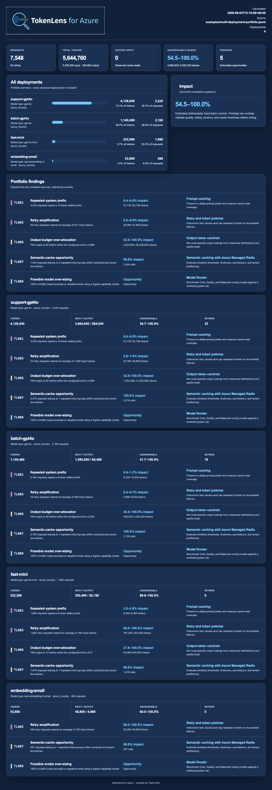

<div align="center">


# TokenLens for Azure

### Lint LLM traces for avoidable token usage

TokenLens is an offline Python CLI and GitHub Action that analyzes OpenAI-compatible JSONL traces, identifies token waste, and maps findings to practical Azure optimizations.

[](#what-is-tokenlens)
[](#prerequisites)
[](#privacy-and-security)
[](#azure-first-portable-core)

**No API key · No Azure account · No network calls · No prompts leaving your machine**

</div>

> [!IMPORTANT]
> TokenLens for Azure is currently **pre-alpha**. The project is usable as an MVP, but command interfaces, rule thresholds, and package names may change before v0.1.

## What is TokenLens?

TokenLens is a developer tool for understanding the hidden cost of LLM applications. It works like a linter for token usage: point it at representative request traces and it reports where context, retries, tools, outputs, caching, or model selection may be wasting tokens.

It is **Azure-first but provider-portable**. The detection engine understands OpenAI-compatible traces, while a separate recommendation layer maps findings to Azure OpenAI, Azure API Management, Microsoft Foundry, Azure AI Search, Azure Monitor, and Application Insights.

## What does it do?

TokenLens:

- analyzes JSONL locally without calling an LLM;
- evaluates eight token-efficiency diagnostics;
- reports evidence, estimated savings ranges, and impact percentages;
- distinguishes measured findings from heuristic opportunities;
- omits rules when the trace data cannot support a finding;
- recommends concrete Azure actions;
- emits terminal, JSON, SARIF, and self-contained HTML reports;
- compares a candidate trace set with a baseline;
- runs advisory by default, with opt-in CI regression thresholds.

The tool does not rewrite prompts, proxy production traffic, or claim guaranteed financial savings.

## How does it work?

```text
OpenAI-compatible JSONL
          │
          ▼
Normalize and redact
          │
          ▼
Run eight offline diagnostics
          │
          ▼
Estimate impact percentages
          │
          ▼
Map findings to Azure actions
          │
          ▼
Text · JSON · SARIF · HTML
```

Every finding follows the same explainable contract:

```json
{
  "rule_id": "TL001",
  "severity": "high",
  "title": "Repeated system prefix",
  "evidence": {
    "affected_requests": 8103,
    "repeated_tokens": 9400000
  },
  "estimated_savings": {
    "min_tokens": 6900000,
    "max_tokens": 9400000
  },
  "impact_min_percent": 18.1,
  "impact_max_percent": 24.7,
  "azure_recommendation": {
    "service": "Azure OpenAI",
    "capability": "Prompt caching"
  }
}
```

Overlapping opportunities are bounded before the aggregate range is reported. Findings include an estimated impact percentage relative to the analyzed token or request volume.

## Example output

<a href="docs/tokenlens-report-preview-v5.png">
  
</a>

<p align="center">
  <em>Sample data · Click the image to open the enlarged preview.</em>
</p>

The report puts the most actionable information first: total trace volume, deployment-level usage, addressable token range, impact-ranked findings, and prioritized Azure actions. The checked-in portfolio example represents 7,548 requests across four deployments.

## Prerequisites

Before installing TokenLens, make sure you have:

- **Python 3.11 or newer**;
- **pip** or **pipx**;
- an OpenAI-compatible JSONL trace file;
- representative request data with `model`, `messages`, and `usage`.

You do **not** need:

- an Azure subscription;
- an Azure OpenAI or OpenAI API key;
- network access at analysis time;
- a database or hosted service.

## Installation

### Install from GitHub with pipx

```bash
pipx install git+https://github.com/zakarel/tokenlens-for-azure.git
```

### Install from GitHub with pip

```bash
python -m pip install git+https://github.com/zakarel/tokenlens-for-azure.git
```

### Install for local development

```bash
git clone https://github.com/zakarel/tokenlens-for-azure.git
cd tokenlens-for-azure
python3 -m venv .venv
.venv/bin/python -m pip install -e ".[dev]"
.venv/bin/tokenlens-azure --help
```

No shell activation is required. On Windows PowerShell, use:

```powershell
py -m venv .venv
.\.venv\Scripts\python.exe -m pip install -e ".[dev]"
.\.venv\Scripts\tokenlens-azure.exe --help
```

For Foundry capture, install the optional dependencies with
`.venv/bin/python -m pip install -e ".[foundry]"`. Activating with
`. .venv/bin/activate` (POSIX) or `.venv\Scripts\Activate.ps1` (PowerShell) is
an optional convenience only.

The package will be published to PyPI after the v0.1 interface stabilizes.

## How to use it

### Analyze a trace file

```bash
.venv/bin/tokenlens-azure analyze requests.jsonl
```

The command is advisory and exits successfully while reporting findings.
Pass multiple JSONL files, a directory, or a glob to analyze every observed
deployment: `.venv/bin/tokenlens-azure analyze "traces/*.jsonl"`.

### Generate a JSON report

```bash
.venv/bin/tokenlens-azure analyze requests.jsonl \
  --format json \
  --output tokenlens.json
```

### Generate a GitHub SARIF report

```bash
tokenlens-azure analyze requests.jsonl \
  --format sarif \
  --output tokenlens.sarif
```

### Generate a shareable HTML report

```bash
tokenlens-azure analyze requests.jsonl \
  --format html \
  --output-dir reports \
  --open
```

When `--output` is omitted, HTML, JSON, and SARIF reports use a UTC filename
such as `tokenlens-report-20260914-082311Z.html`; collisions receive `-2`,
`-3`, and so on. Text remains on stdout. Use `--output` when a script needs a
stable path.

### First-run Foundry capture (Entra ID)

TokenLens analysis is offline. Capture is an explicit, separate step using the
Entra ID credential chain—no API key is required:

```bash
az login
.venv/bin/tokenlens-azure doctor
.venv/bin/tokenlens-azure init-foundry
export AZURE_OPENAI_ENDPOINT="https://YOUR-RESOURCE.openai.azure.com/"
.venv/bin/python examples/capture_foundry.py \
  --deployment YOUR_DEPLOYMENT \
  --prompt "Classify this support request as billing or support."
.venv/bin/tokenlens-azure analyze foundry-traces --format html --open
```

The capture example performs one real request only when a deployment and
prompt are supplied, records the deployment and returned model separately, and
never writes credentials or bearer tokens. Your Entra identity needs an Azure
OpenAI/Foundry inference role on the resource. API-key authentication is not
the primary onboarding path and is intentionally not shown here.

`doctor` checks Python, write permissions, optional packages, endpoint
configuration, and the `DefaultAzureCredential` chain without exposing
secrets. `init-foundry` creates a private `foundry-traces/` directory and a
copy of the capture example.

### Compare a candidate with a baseline

```bash
tokenlens-azure compare \
  baseline.jsonl \
  candidate.jsonl \
  --fail-on-regression 10
```

`--fail-on-regression` is optional. It enables an explicit CI gate when the candidate’s addressable-waste percentage increases beyond the supplied number of percentage points.

### Read from standard input

```bash
cat requests.jsonl | tokenlens-azure analyze -
```

## Input format

TokenLens accepts one JSON object per line. Only `model`, `messages`, and `usage` are required; the other fields improve diagnostic coverage.

```json
{
  "timestamp": "2026-09-03T12:00:00Z",
  "request_id": "req-123",
  "model": "gpt-5-mini",
  "messages": [
    {"role": "system", "content": "You are a support assistant."},
    {"role": "user", "content": "Where is my order?"}
  ],
  "tools": [],
  "max_output_tokens": 1000,
  "usage": {
    "input_tokens": 4200,
    "output_tokens": 380,
    "cached_tokens": 1800
  },
  "latency_ms": 1450,
  "status_code": 200,
  "retry_of": null,
  "retrieved_chunks": [],
  "metadata": {
    "workload": "support-assistant",
    "tenant": "hashed-value"
  }
}
```

Standard OpenAI and Azure OpenAI request/response envelopes are normalized by the importer, so applications do not need to redesign their logging schema.

## Eight diagnostics

| Rule | Detects |
|---|---|
| `TL001` | Repeated system prefixes and policy text |
| `TL002` | Unbounded conversation-history growth |
| `TL003` | Oversized or unused tool schemas |
| `TL004` | Duplicate or overlapping retrieval context |
| `TL005` | Retry amplification |
| `TL006` | Excessive output allocation |
| `TL007` | Semantic-cache opportunities |
| `TL008` | Possible model over-sizing |

`TL008` is intentionally advisory: it recommends evaluation with a quality baseline rather than blindly downgrading a model.

## Azure-first recommendations

| Finding | Azure remediation |
|---|---|
| Repeated stable prompt prefix | Azure OpenAI prompt caching |
| Repeated equivalent requests | APIM semantic caching with Azure Managed Redis |
| Token spikes or uncontrolled consumers | APIM token rate limits and quotas |
| Likely model over-sizing | Microsoft Foundry Model Router evaluation |
| Noisy retrieval context | Azure AI Search chunking, hybrid retrieval, and semantic reranking |
| Prompt/context compression opportunity | Custom compression workload hosted on Azure |
| Cross-workload visibility | Application Insights and Azure Monitor instrumentation |

The Azure mapping addresses the same optimization problem; it does not imply feature-for-feature parity with every open-source project.

## GitHub Actions

The checked-in composite action returns a `report-path` output and uses a
timestamped report filename:

```yaml
name: Token efficiency

on:
  pull_request:

jobs:
  tokenlens:
    runs-on: ubuntu-latest
    steps:
      - uses: actions/checkout@v4
      - uses: actions/setup-python@v5
        with:
          python-version: "3.12"
      - uses: ./
        id: tokenlens
        with:
          input: test-data/requests.jsonl
          format: sarif
          fail-on-regression: "10"
      - uses: github/codeql-action/upload-sarif@v3
        with:
          sarif_file: ${{ steps.tokenlens.outputs.report-path }}
```

Existing inefficiencies stay in the baseline; pull requests surface newly introduced waste.

For scheduled reporting, see `.github/workflows/tokenlens-scheduled.yml`. It is
designed for a private/self-hosted runner where `TOKENLENS_TRACE_INPUT` points
to an explicit secure source; only short-retention HTML/JSON artifacts are
uploaded, never raw traces. Locally, use `scripts/run-scheduled-report.sh`
with `TOKENLENS_TRACE_INPUT` and `TOKENLENS_REPORT_DIR`. macOS `launchd`,
Linux `cron`, and Windows Task Scheduler can invoke that wrapper without
activating a virtual environment. The wrapper never uploads or emails reports.

## Configuration

Create `.tokenlens.yml` in the repository root:

```yaml
version: 1

analysis:
  tokenizer: auto
  redact_content: true
  tenant_key: metadata.tenant
  workload_key: metadata.workload

rules:
  TL001:
    enabled: true
    minimum_repeated_tokens: 10000
  TL004:
    enabled: true
    similarity_threshold: 0.85
  TL008:
    enabled: true
    severity: info

ci:
  advisory: true
  fail_on_regression_percent: null
```
## License

TokenLens for Azure is released under the [MIT License](LICENSE).

---

<div align="center">


</div>
